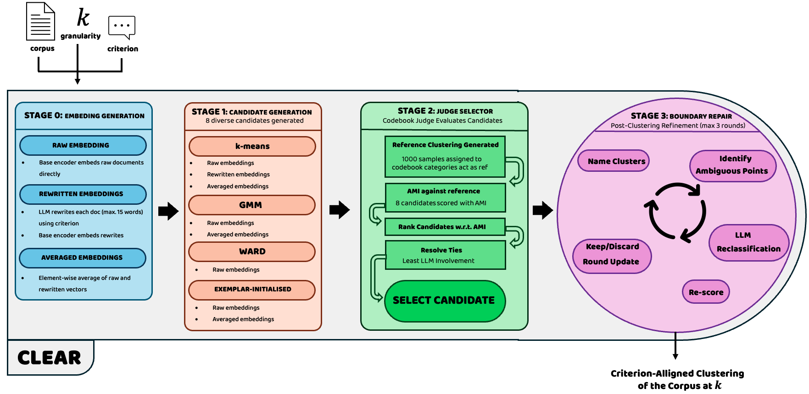

# Meaning Over Geometry: CLEAR and the Codebook Judge

**Criterion-driven text clustering and label-free evaluation with Large Language Models.**


This repository supplements the MSc thesis *Meaning Over Geometry: Criterion-Driven Text
Clustering and Evaluation with Large Language Models* (Louis Arts, UCL MSc Data Science and
Machine Learning, in collaboration with [Chattermill](https://chattermill.com) through UCL's
Industry Exchange Network). It contains the two algorithms the thesis introduces, every
dataset, result file and figure behind the thesis, and ready-to-use command-line tools so
anyone can run both algorithms on their own corpus:

- **The codebook judge** scores any clustering of any corpus *without ground-truth labels*,
  given only a one-sentence criterion ("cluster by customer intent"). Validated against
  human benchmark labels across 19 corpora and five judge LLMs (median Spearman ρ up to +0.93).
- **CLEAR** (*Clustering with LLM Evaluation And Repair*) clusters a corpus by a stated
  criterion: it builds eight candidate clusterings, lets the judge select the best, and
  repairs the boundary documents. Matches or beats published state-of-the-art
  LLM-in-the-loop methods on a fair share of the benchmark suite, at roughly one cent per
  100 documents.



---

## Repository structure

```
├── CLEAR_algo/          the CLEAR algorithm
│   ├── run_clear.py     CLI: cluster your own corpus
│   ├── critclust/       the pipeline package (candidates, judge, repair, config)
│   ├── scripts/         thesis study runners (all 19 benchmarks × 5 seeds)
│   └── artifacts/       cached LLM artifacts (codebooks, references, repair) per run
├── codebook_judge/      the codebook judge, standalone
│   ├── run_judge.py     CLI: score your own clustering
│   ├── judge.py         codebook discovery + document assignment (thesis §3.1)
│   └── criteria.json    the 19 benchmark criterion sentences
├── analysis/            analysis code, one folder per research question
│   ├── rq1/             judge validity pipeline + figure scripts
│   ├── rq2/             granularity estimators + notebook
│   ├── rq3/             CLEAR results notebook
│   └── rq4/             state-of-the-art comparison notebook
├── data/                all input data
│   ├── benchmarks/      the 19 evaluation corpora (text + benchmark label)
│   ├── rq1/, rq2/       per-question inputs (partitions, judge replicates, method runs)
│   ├── glm5_gen/        cached LLM generations (rewrites, exemplars, references)
│   └── published_results.csv   every published NMI/ACC value in the surveyed literature
├── results/             all result tables (CSV)
│   ├── rq1/, rq2/       judge validity and granularity scoreboards
│   └── clear/           CLEAR runs, baselines, selector comparison (all four settings)
├── figures/             every figure in the thesis (PDF) + source/ for the survey figures
├── examples/            a 150-document sample corpus + example outputs of both CLIs
├── thesis/              thesis LaTeX source (figs/ ready; main.tex + references.bib live here)
└── requirements.txt
```

## What each part does

### `CLEAR_algo/`: the CLEAR algorithm
| File / folder | Role |
|---|---|
| `run_clear.py` | **The user-facing CLI.** Clusters any CSV of documents by a stated criterion at a chosen `k`, writes cluster ids and LLM-chosen cluster names, prints the judge score. |
| `critclust/config.py` | Every constant in one place: paths, the 19-benchmark roster, criterion loading, matched configurations per record holder, seeds, tie-break order, the budget guard ceiling. |
| `critclust/data.py` | Benchmark loading, NMI/ACC scoring (Hungarian matching), and the gateway budget guard. |
| `critclust/embeddings.py` | Embeds documents through the gateway or a local sentence-transformer, L2-normalises, memoises every matrix to `.npy` caches. |
| `critclust/generation.py` | The paid LLM artifacts: criterion rewrites (batched), category exemplars, and the judge's reference labelling, all cached per corpus. |
| `critclust/codebooks.py` | Codebook discovery prompts and parsing (the single-shot discovery the thesis uses, plus chunked fallbacks for small-context models). |
| `critclust/llm.py` | Gateway plumbing: model binding, context-aware batch planning, the batched classification prompt with per-document fallback. |
| `critclust/pools.py` | Builds the eight candidate clusterings (k-means / GMM / Ward / exemplar-initialised, over raw / rewritten / averaged spaces). |
| `critclust/judges.py` | Label-free selection: AMI against the reference, with the less-LLM tie-break within 0.01 (thesis §3.3). |
| `critclust/repair.py` | Boundary repair: LLM cluster naming, least-confident document reclassification in batches of 20, judge-gated rounds (max three). |
| `critclust/runners.py` | The thesis study orchestration: per benchmark × seed, checkpointed and resumable, writing the `results/clear/` CSVs. |
| `critclust/plots.py` | Shared plotting helpers and exact published-SOTA lookups used by the RQ4 notebook. |
| `scripts/run_study.py`, `run_baseline.py` | Reproduce the thesis runs: CLEAR on all 19 benchmarks × 5 seeds, and the seed-paired k-means baseline. |
| `scripts/selector_comparison.py`, `check_ready.py` | The selector-strategy analysis behind the judge-vs-oracle figure, and a preflight check that all inputs are in place. |
| `artifacts/` | Every cached LLM artifact from the thesis runs: codebooks and reference labellings (`codebooks/`), cluster names and classify caches (`repair/`), generated rewrites/exemplars (`generation/`), plus empty embedding-cache dirs that refill on demand. |
| `criteria.json`, `sota_config.json` | The 19 criterion sentences; the exact encoder/LLM stack of each published record holder for the matched comparison. |

### `codebook_judge/`: the judge, standalone
| File | Role |
|---|---|
| `run_judge.py` | **The user-facing CLI.** Scores any clustering CSV against a criterion: samples documents, discovers a codebook, labels a reference set, prints the AMI judge score with degeneracy warnings. |
| `judge.py` | The judge's core (thesis §3.1): the codebook-discovery prompt (reasoning on), the per-document assignment prompt (reasoning off), parsing and scoring helpers. |
| `LLM_call.py` | Minimal gateway client. Reads `.env`, retries, exposes `ask_llm()`. |
| `criteria.json` | The 19 benchmark criterion sentences, for reference. |

### `analysis/`: one folder per research question
**`rq1/`, is the judge valid?** Scripts numbered in execution order:
`00*` embed the corpora on the generic-instruction INSTRUCTOR bed. `02` generates the 1,222-candidate test bed of clusterings (k-means, GMM, spectral, Ward and Leiden at five granularities and three seeds; `kmeans/gmm/spectral/embedder.py` are its clustering helpers), and `03` computes each candidate's geometric metrics. `05`-`07` run one judge pass (codebook, assignment, scoring), `08` builds the per-candidate analysis table, `09` and `11`-`14` run the ten-replicate campaigns for the five judge LLMs, and `10` and `15` draw the thesis figures.

**`rq2/`, can LLMs infer granularity?** `00` writes the suite metadata, `01`-`02` run the eight estimators on the primary LLM, and `03` runs the silhouette-argmax baseline over ten seeds. `04`-`08` replicate everything on `gpt-4o-mini` and `gpt-3.5-turbo`, and `rq2_analysis.ipynb` builds the scoreboard table and the calibration figure.

**`rq3/rq3_results.ipynb`** draws CLEAR's headline quality, the k-means uplift, the judge-vs-oracle selector comparison and the repair ablation, from `results/clear/`.

**`rq4/rq4_results.ipynb`** compares CLEAR against every published record, unmatched and matched, plus the encoder/LLM factorial, from `results/clear/` and `data/published_results.csv`.

### `data/`: all inputs
| Folder / file | Contents |
|---|---|
| `benchmarks/` | The 19 evaluation corpora as `<name>_texts.csv` (columns `text`, `gold`). These are the exact document sets every experiment runs on. |
| `rq1/texts/`, `rq1/partitions_instructor_gen/` | Per-benchmark document texts and the full candidate test bed (one column per candidate clustering, plus `true_label`). |
| `rq1/codebooks/`, `rq1/replicates*/` | The judge's discovered codebooks and reference labellings, from run 1 plus replicate runs 2–10, for all five judge LLMs. |
| `rq1/reference_labels/`, `rq1/master_table_instructor_gen.csv`, `rq1/doc_lengths.csv` | Benchmark labels for scoring, the per-candidate master table behind the RQ1 analysis, corpus length statistics. |
| `rq2/` | Every estimator's inferred `k` per run (`llm_k_runs*.csv` for the three LLMs), the pairwise same-category votes, and the silhouette baseline seeds. |
| `glm5_gen/`, `matched_gen/` | The cached LLM generations behind the CLEAR runs (rewrites, exemplars, reference samples) for the default and matched configurations. |
| `published_results.csv` | Every published NMI/ACC value in the surveyed literature, with method, variant, encoder and LLM. The source of truth for the SOTA comparison.. |

### `results/`: all outputs
| Folder | Contents |
|---|---|
| `rq1/` | The judge-validity analysis table, the ten-replicate correlation files per judge LLM, replicate bookkeeping and reference-quality diagnostics. |
| `rq2/` | The suite metadata and the granularity scoreboards (primary LLM plus both replications). |
| `clear/` | CLEAR runs/summaries/candidate-counts for all four settings (unmatched, matched, encoder-matched, LLM-matched), the k-means baselines, the selector comparison and the judge's winner counts. |

### `figures/`, `examples/` and the root
`figures/` holds every figure in the thesis as vector PDF plus the CLEAR pipeline diagram; `figures/source/` contains the notebook and data that generate the literature-survey figures. `examples/` is a 150-document sample corpus with real outputs from both CLIs, so you can see the expected input and output formats before spending a token. `thesis/` is the compilable thesis source: `thesis/figs/` already carries every figure and the title-page logo under the exact names the LaTeX expects, with `main.tex` and `references.bib` alongside. Compile with `pdflatex main.tex` + `bibtex main` from inside `thesis/`. The root carries `requirements.txt` (pinned to the versions used) and expects a `.env` for live runs.

## Where to find what the thesis reports

| Thesis content | Figures / tables | Code | Data |
|---|---|---|---|
| RQ1, judge validity (5 judge LLMs) | `figures/rq1_*.pdf`, judge validity table | `analysis/rq1/` scripts | `results/rq1/`, `data/rq1/` |
| RQ2, granularity estimation | `figures/rq2c_ex2_calibration.pdf`, scoreboards incl. appendix | `analysis/rq2/` | `data/rq2/`, `results/rq2/` |
| RQ3, CLEAR quality, uplift, selector, repair | `figures/rq3c_*.pdf`, `figures/rq4c_C_repair_delta.pdf` | `analysis/rq3/rq3_results.ipynb` | `results/clear/` |
| RQ4, against published SOTA, matched configs | `figures/rq4c_*.pdf` | `analysis/rq4/rq4_results.ipynb` | `results/clear/`, `data/published_results.csv` |
| Literature survey figures | `figures/fig_*.pdf` | `figures/source/litreview_plots.ipynb` | `data/published_results.csv` |
| The CLEAR pipeline itself | `figures/CLEAR_VISUALISATION.png` | `CLEAR_algo/critclust/` | `CLEAR_algo/artifacts/` |

All result CSVs are committed, so **every thesis figure and table regenerates offline, with no
LLM calls and no API key needed** (see [Testing](#testing--reproducing-the-thesis-analyses)).
An API key is only needed to run the algorithms on new corpora.

---

## Getting started

### Prerequisites

- **Python 3.12**
- An **OpenAI-compatible LLM gateway** (only for running the algorithms on new corpora):
  the thesis used `glm-5` for CLEAR and `gemini-2.5-flash` for the judge, plus
  `gemini-embedding-001` for embeddings, all through one gateway endpoint.

### Installation

```bash
git clone <this-repository>
cd <this-repository>
python3.12 -m venv .venv
source .venv/bin/activate
pip install -r requirements.txt
```

### Configuration

Create a `.env` file in the repository root (only needed for live LLM runs):

```bash
OPENAI_BASE_URL=https://your-llm-gateway/v1
OPENAI_API_KEY=sk-...
```

Any OpenAI-compatible endpoint works; model names are CLI flags with the thesis
configuration as the default. All runs are temperature zero. A budget guard
(`CLEAR_algo/critclust/config.py: BUDGET_STOP`) aborts runs past a spend ceiling if your
gateway exposes spend at `/key/info`.

---

## Usage

### Score a clustering you already have (codebook judge)

Input: a CSV with a text column and a cluster column, plus a one-sentence criterion.

```bash
cd codebook_judge
python run_judge.py ../examples/example_clustered.csv \
    --criterion "which assistant-command intent the utterance expresses" \
    --discovery 40 --reference 60      # demo sizes; defaults are 300 / 1,000
```

```
discovering codebook from 40 documents ...
  8 categories -> ../examples/example_clustered_judge/codebook.json
labelling 60 reference documents ...

judge score (AMI vs reference, 60 documents): 0.9078
```

The score is chance-corrected agreement (AMI) between your clustering and the judge's
criterion-conditioned reference labelling. Higher is better, and the thesis validates that
it tracks human benchmark labels. The discovered codebook and reference are saved next to
the input for inspection, and degeneracy warnings fire when the criterion does not fit the
corpus (thesis §3.1).

### Cluster a new corpus (CLEAR)

Input: a CSV with a text column, a criterion, and the number of clusters `k`.

```bash
cd CLEAR_algo
python run_clear.py ../examples/example_corpus.csv \
    --criterion "which assistant-command intent the utterance expresses" \
    --k 7
```

```
CLEAR on 150 documents, k=7, criterion: 'which assistant-command intent the utterance expresses'
codebook: 11 categories
embedded: 150 docs x 3072 dims
judge reference: 119/120 usable documents
judge scores: km_concat 0.885, agglo_raw 0.851, km_rewrite 0.851, ...
selected candidate: km_concat
repair: kept 0 round(s), 8 LLM calls

final judge score (AMI vs reference): 0.8854
clusters written to ../examples/example_corpus_clusters.csv
    0     25 docs  Find Movie Showtimes
    1     24 docs  Play Music
    2     25 docs  Weather Forecast Inquiry
    ...
```

The output CSV carries every input column plus `cluster` and an LLM-chosen `cluster_name`.
All LLM artifacts cache under `CLEAR_algo/artifacts/` by corpus name, so re-runs are free.
Cost scales as the thesis's Token Cost section describes, roughly one cent per 100
documents at the default configuration.

### Re-run the thesis studies

```bash
cd CLEAR_algo/scripts
python run_study.py        # CLEAR on all 19 benchmarks (resumable; results/clear/)
python run_baseline.py     # the seed-paired k-means baseline
```

The RQ1 judge pipeline (`analysis/rq1/`, scripts numbered in execution order) and the RQ2
estimators (`analysis/rq2/`) follow the same pattern; each script documents its inputs and
outputs in its header.

---

## Testing / reproducing the thesis analyses

There is no separate unit-test suite; verification is reproducing the thesis outputs from
the committed result files, which needs **no API key**:

```bash
# every analysis notebook end-to-end (regenerates the RQ2-RQ4 thesis figures)
for nb in analysis/rq2/rq2_analysis.ipynb analysis/rq3/rq3_results.ipynb \
          analysis/rq4/rq4_results.ipynb figures/source/litreview_plots.ipynb; do
  jupyter nbconvert --to notebook --execute --inplace "$nb" \
      --ExecutePreprocessor.kernel_name=python3
done

# the RQ1 thesis figures
python analysis/rq1/10_hbars_all_beds.py
python analysis/rq1/15_judge_summary.py

# everything compiles
python -m compileall -q analysis CLEAR_algo codebook_judge
```

Each notebook prints the exact statistics quoted in the thesis and writes the figure PDFs
into `figures/`. For a live end-to-end check of the two CLIs, the `examples/` commands
under [Usage](#usage) run in a few minutes for a few cents.

---

## Features

- **Label-free clustering evaluation** from a one-sentence criterion, no ground truth needed.
- **Criterion-driven clustering** with automatic candidate selection and boundary repair.
- **LLM-named clusters** in the output, ready for human consumption.
- **Model-agnostic**: any OpenAI-compatible gateway; encoder and LLM are flags.
- **Caching throughout**: every paid LLM artifact is reused across runs and seeds.
- **Budget guard**: runs abort at a configurable spend ceiling.
- **Full reproducibility**: all 19 thesis figures and every table regenerate offline from
  committed data.

## Contributing

This repository is frozen for thesis examination; the code is research software, not a
maintained library. Questions, bug reports and suggestions are welcome through GitHub
issues. If you build on the algorithms, please cite the thesis.

## License

© 2026 Louis Arts. Provided for academic examination and research use; contact the author
for any other use. The benchmark corpora in `data/benchmarks/` derive from public datasets whose
original licenses and citations are listed in the thesis appendix.

## Contact

**Louis Arts**, UCL MSc Data Science and Machine Learning, in collaboration with
Chattermill through the UCL Industry Exchange Network. Supervised by Dr. Carlo Ciliberto
(UCL) and, at Chattermill, Dr. Aji Ghose and Patrycja Śliwiak. For questions about this
repository, open a GitHub issue.
